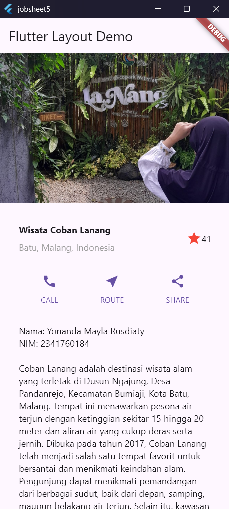

# Jobsheet 5 - Flutter Layout

**Nama:** Yonanda Mayla Rusdiaty  
**NIM:** 2341760184  
**Kelas:** SIB - 3D

Proyek Flutter untuk mempelajari implementasi layout widget dengan tema wisata Coban Lanang, Batu, Malang.

## Daftar Praktikum

- [Praktikum 1: Membangun Layout di Flutter](#praktikum-1-membangun-layout-di-flutter)
- [Praktikum 2: Implementasi Button Row](#praktikum-2-implementasi-button-row)
- [Praktikum 3: Implementasi Text Section](#praktikum-3-implementasi-text-section)
- [Praktikum 4: Implementasi Image Section](#praktikum-4-implementasi-image-section)

---

## Praktikum 1: Membangun Layout di Flutter

### Tujuan

Membangun layout dasar aplikasi Flutter dengan implementasi title row yang berisi informasi wisata.

### Langkah-langkah

#### Langkah 4: Implementasi Title Row

Membuat widget `titleSection` yang berisi:

- **Column dengan Expanded**: Menampung judul dan lokasi wisata
- **CrossAxisAlignment.start**: Mengatur alignment ke kiri
- **Container dengan padding**: Memberikan spacing pada teks
- **Icon dan Text**: Rating bintang dengan angka

**Kode implementasi:**

```dart
Widget titleSection = Container(
  padding: const EdgeInsets.all(32),
  child: Row(
    children: [
      Expanded(
        child: Column(
          crossAxisAlignment: CrossAxisAlignment.start,
          children: [
            Container(
              padding: const EdgeInsets.only(bottom: 8),
              child: const Text(
                'Wisata Coban Lanang',
                style: TextStyle(fontWeight: FontWeight.bold),
              ),
            ),
            Text(
              'Batu, Malang, Indonesia',
              style: TextStyle(color: Colors.grey[500]),
            ),
          ],
        ),
      ),
      Icon(Icons.star, color: Colors.red[500]),
      const Text('41'),
    ],
  ),
);
```

**Hasil:**

- Title section menampilkan nama wisata "Coban Lanang"
- Lokasi "Batu, Malang, Indonesia" dengan warna abu-abu
- Rating bintang merah dengan angka 41

---

## Praktikum 2: Implementasi Button Row

### Tujuan

Membuat baris tombol dengan ikon dan label yang konsisten menggunakan helper method.

### Langkah-langkah

#### Langkah 1: Buat Method `_buildButtonColumn`

Method helper untuk membuat kolom tombol dengan parameter warna, ikon, dan label.

```dart
Column _buildButtonColumn(Color color, IconData icon, String label) {
  return Column(
    mainAxisSize: MainAxisSize.min,
    mainAxisAlignment: MainAxisAlignment.center,
    children: [
      Icon(icon, color: color),
      Container(
        margin: const EdgeInsets.only(top: 8),
        child: Text(
          label,
          style: TextStyle(
            fontSize: 12,
            fontWeight: FontWeight.w400,
            color: color,
          ),
        ),
      ),
    ],
  );
}
```

#### Langkah 2: Buat Widget `buttonSection`

Implementasi baris tombol dengan 3 kolom yang menggunakan `MainAxisAlignment.spaceEvenly`.

```dart
Color color = Theme.of(context).primaryColor;

Widget buttonSection = Row(
  mainAxisAlignment: MainAxisAlignment.spaceEvenly,
  children: [
    _buildButtonColumn(color, Icons.call, 'CALL'),
    _buildButtonColumn(color, Icons.near_me, 'ROUTE'),
    _buildButtonColumn(color, Icons.share, 'SHARE'),
  ],
);
```

**Hasil:**

- Tiga tombol dengan spacing yang sama
- Ikon call, route, dan share dengan warna primary theme
- Label di bawah setiap ikon

---

## Praktikum 3: Implementasi Text Section

### Tujuan

Menambahkan section teks dengan informasi lengkap tentang wisata dan identitas pembuat.

### Langkah-langkah

#### Langkah 1: Buat Widget `textSection`

Section teks dengan padding dan `softWrap` untuk text wrapping otomatis.

```dart
Widget textSection = Container(
  padding: const EdgeInsets.all(32),
  child: const Text(
    'Nama: Yonanda Mayla Rusdiaty\n'
    'NIM: 2341760184\n\n'
    'Coban Lanang adalah destinasi wisata alam yang terletak di Dusun Ngajung, '
    'Desa Pandanrejo, Kecamatan Bumiaji, Kota Batu, Malang. Tempat ini menawarkan '
    'pesona air terjun dengan ketinggian sekitar 15 hingga 20 meter dan aliran air '
    'yang cukup deras serta jernih...',
    softWrap: true,
  ),
);
```

**Fitur softWrap:**

- `softWrap: true` memungkinkan teks membungkus ke baris berikutnya
- Pembungkusan terjadi pada batas kata (word boundary)
- Responsive terhadap berbagai ukuran layar

**Hasil:**

- Menampilkan identitas mahasiswa
- Deskripsi lengkap tentang Coban Lanang
- Text wrapping otomatis untuk readability

---

## Praktikum 4: Implementasi Image Section

### Tujuan

Menambahkan gambar wisata dan mengubah layout menjadi scrollable menggunakan ListView.

### Langkah-langkah

#### Langkah 1: Siapkan Asset Gambar

1. Membuat folder `images/` di root project
2. Menambahkan file `coban.jpg` ke folder `images/`
3. Konfigurasi di `pubspec.yaml`:

```yaml
flutter:
  assets:
    - images/coban.jpg
```

#### Langkah 2: Tambahkan Gambar ke Body

Implementasi widget gambar dengan ukuran dan fit yang sesuai.

```dart
Widget imageSection = Image.asset(
  'images/coban.jpg',
  width: 600,
  height: 240,
  fit: BoxFit.cover,
);
```

#### Langkah 3: Ubah Column menjadi ListView

Mengganti Column dengan ListView untuk mendukung scroll dinamis.

```dart
body: ListView(
  children: [imageSection, titleSection, buttonSection, textSection],
),
```

**Keuntungan ListView:**

- **Scrollable**: Mendukung scroll vertikal
- **Responsive**: Cocok untuk berbagai ukuran layar
- **Performance**: Lebih efisien untuk konten panjang
- **User Experience**: Smooth scrolling experience

### Hasil Akhir Praktikum 4


_Gambar: Hasil implementasi lengkap aplikasi wisata Coban Lanang dengan layout scrollable_

**Struktur Layout Final:**

1. **Image Section**: Gambar wisata Coban Lanang
2. **Title Section**: Nama dan lokasi wisata dengan rating
3. **Button Section**: Tombol CALL, ROUTE, dan SHARE
4. **Text Section**: Identitas dan deskripsi lengkap

---

## Fitur Aplikasi

### Layout Components

- ✅ **Responsive Design**: Menggunakan Expanded dan Flexible widgets
- ✅ **Image Display**: Asset gambar dengan BoxFit.cover
- ✅ **Interactive Buttons**: Button row dengan consistent styling
- ✅ **Typography**: Proper text styling dan hierarchy
- ✅ **Scrollable Content**: ListView untuk better UX

### Technical Implementation

- ✅ **Widget Composition**: Modular design dengan reusable components
- ✅ **Asset Management**: Proper image asset configuration
- ✅ **Theme Integration**: Menggunakan theme colors untuk consistency
- ✅ **Layout Optimization**: Efficient layout dengan minimal nesting

## Struktur Project

```
jobsheet5/
├── lib/
│   └── main.dart              # Main application file
├── images/
│   ├── coban.jpg             # Gambar wisata Coban Lanang
│   └── praktikum4.png        # Screenshot hasil praktikum
├── pubspec.yaml              # Project configuration
└── README.md                 # Dokumentasi project
```

## Cara Menjalankan

1. Clone repository ini
2. Pastikan Flutter SDK terinstall
3. Jalankan `flutter pub get` untuk install dependencies
4. Jalankan `flutter run` untuk menjalankan aplikasi

---

_Dibuat sebagai tugas Jobsheet 5 - Pemrograman Mobile_
